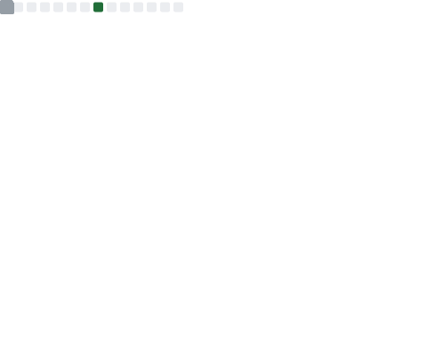
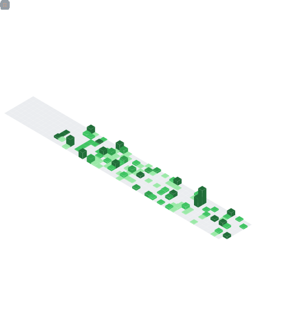

<p align="center">
<a href="https://mrdhnto.my.id">
    
</a>
</p>

###

<div align="center">

</div>

<br clear="both">


<br clear="both">

<div align="center">
  
  
</div>

<!--START_SECTION:waka-->

```txt
From: 25 October 2022 - To: 28 June 2026

Total Time: 3,175 hrs 41 mins

PHP                        1,113 hrs 5 mins      >>>>>>>>>----------------   35.05 %
JavaScript                 1,016 hrs 50 mins     >>>>>>>>-----------------   32.02 %
Vue.js                     350 hrs 6 mins        >>>----------------------   11.02 %
Other                      255 hrs 23 mins       >>-----------------------   08.04 %
Markdown                   162 hrs 41 mins       >------------------------   05.12 %
```

<!--END_SECTION:waka-->

[cvwebsiteimg]: https://img.shields.io/badge/portfolio-%23000.svg?style=for-the-badge
[linkedinimg]: https://img.shields.io/static/v1?style=for-the-badge&message=LinkedIn&color=0A66C2&logo=LinkedIn&logoColor=FFFFFF&label=
[cvwebsite]: https://mrdhnto.my.id
[linkedin]: https://linkedin.com/in/rm121514
