<p align="center">
<a href="https://mrdhnto.my.id">
    
</a>
</p>

---
- 💼 I’m currently working at Telco Company as Full-Stack Developer and Server Administrator.
- 💻 Also working as Freelance doing WEB Dev, IT Support & Linux Server Administrator.
- 🌱 I’m currently learning Web Dev, Linux Server, DevOps & other dev-related skills.
- 🥅 2024 Goals: Polishing my WEB Dev skills, Linux Server and other dev-related skills.
- ⚡ Fun fact: I'm Mood-Driven Person, whenever my mood strikes I'll working without paying any attention to my surrounding even on myself.


### Connect with me:
[![Portfolio][cvwebsiteimg]][cvwebsite]
[![LinkedIn][linkedinimg]][linkedin]
[![Instagram][instagramimg]][instagram]
[![Facebook][facebookimg]][facebook]

### Languages and Tools:
<p>
  
  
  
  
  <!--  -->
  
</p>

<p>
    
    
    
    
    
    
    
    
    <!--  -->
    
    <!--  -->
    
    
    
    
    
    <!--  -->
</p>

<p>
  
  
  
<!--    -->
  
  
  
  <!--  -->
  
</p>

### Photo/Video Tools:
<p>
  
  
  
  
</p>

---

### My Stats
<p align="center">
    <a href="https://github.com/mrdhnto">
        
    </a>
    <div align="center" style="display:flex; justify-content:center;">
      <a href="https://github.com/mrdhnto">
        
      </a>
      <a href="https://github.com/mrdhnto">
        
      </a>
    </div>
</p>

<div align="center" style="overflow: hidden justify-content:space-around;">
  
  
</div>

<!--START_SECTION:waka-->

```txt
From: 25 October 2022 - To: 05 July 2024

Total Time: 1,802 hrs 15 mins

PHP                        1,099 hrs 10 mins>>>>>>>>>>>>>>>----------   60.99 %
JavaScript                 324 hrs 27 mins >>>>>--------------------   18.00 %
Vue.js                     202 hrs 46 mins >>>----------------------   11.25 %
Other                      66 hrs 11 mins  >------------------------   03.67 %
SCSS                       22 hrs 28 mins  -------------------------   01.25 %
```

<!--END_SECTION:waka-->

[cvwebsiteimg]: https://img.shields.io/badge/portfolio-%23000.svg?style=for-the-badge
[instagramimg]: https://img.shields.io/static/v1?style=for-the-badge&message=Instagram&color=E4405F&logo=Instagram&logoColor=FFFFFF&label=
[linkedinimg]: https://img.shields.io/static/v1?style=for-the-badge&message=LinkedIn&color=0A66C2&logo=LinkedIn&logoColor=FFFFFF&label=
[facebookimg]: https://img.shields.io/static/v1?style=for-the-badge&message=Facebook&color=1877F2&logo=Facebook&logoColor=FFFFFF&label=
[cvwebsite]: https://mrdhnto.my.id
[instagram]: https://instagram.com/ra.121514
[linkedin]: https://linkedin.com/in/rm121514
[facebook]: https://facebook.com/ryoken.anezaki
